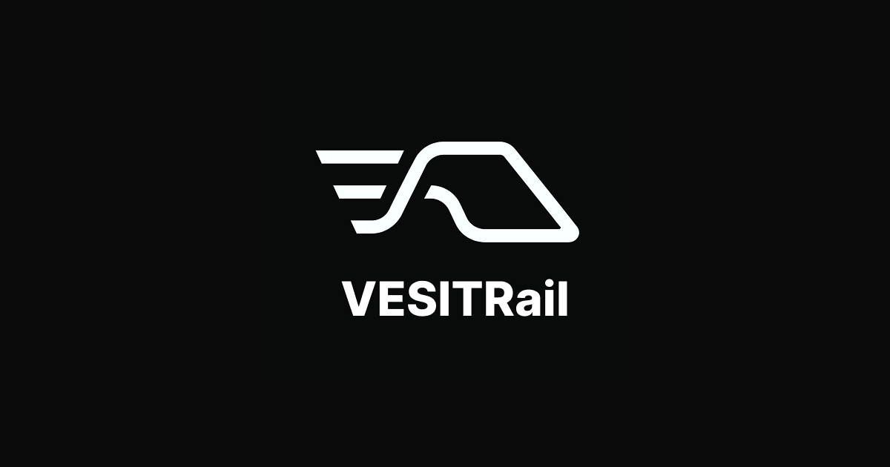

<div align="center">



# VESITRail

**Streamlined Railway Concessions with Real-time Tracking**

_A modern web application for VESIT students to apply for and manage railway concessions with ease._

</div>

---

## Features

### For Students

- **Easy Application Process** - Apply for railway concessions with pre-filled details.
- **Real-time Tracking** - Monitor application status with live updates.
- **Address Management** - Request and manage home station and address updates.
- **Progressive Web App** - Installable web application with offline support.
- **Smart Notifications** - Receive push notifications regarding application updates.
- **Application History** - View past applications and current statuses.
- **Digital Booklets** - Access digital concession booklets.

### For Administrators

- **Student Management** - Review and approve student registrations.
- **Application Processing** - Process and manage concession requests efficiently.
- **Analytics Dashboard** - Track application metrics and generate insights.
- **Booklet Management** - Issue and manage concession booklets.
- **Comprehensive Reports** - Generate detailed reports and analytics.
- **Address Change Requests** - Process and verify student address change requests.

### Technical Highlights

- **Optimized Performance** - Built with Next.js 15 App Router.
- **Modern UI/UX** - Accessible, responsive interface built with Radix UI and Tailwind CSS.
- **Secure Authentication** - Google OAuth integration powered by Better Auth.
- **Theme Support** - Native light and dark mode integration.
- **Real-time Updates** - Push notification infrastructure for status changes.

---

## Tech Stack

<table>
  <tr>
    <td><strong>Frontend</strong></td>
    <td>
      
      
      
      
    </td>
  </tr>
  <tr>
    <td><strong>Backend</strong></td>
    <td>
      
      
      
    </td>
  </tr>
  <tr>
    <td><strong>Database</strong></td>
    <td>
      
    </td>
  </tr>
  <tr>
    <td><strong>UI Components</strong></td>
    <td>
      
      
      
    </td>
  </tr>
  <tr>
    <td><strong>File Upload & PDF</strong></td>
    <td>
      
      
    </td>
  </tr>
  <tr>
    <td><strong>Notifications</strong></td>
    <td>
      
    </td>
  </tr>
  <tr>
    <td><strong>Testing</strong></td>
    <td>
      
    </td>
  </tr>
</table>

---

## Quick Start

### Prerequisites

- PostgreSQL database
- Node.js 18+ and pnpm
- Google OAuth credentials
- Cloudflare R2 bucket (for file storage)
- Firebase project (for push notifications)

### Local Development Setup

1. **Clone the repository**

   ```bash
   git clone https://github.com/VESITRail/VESITRail.git
   cd VESITRail
   ```

2. **Install dependencies**

   ```bash
   pnpm install --frozen-lockfile
   ```

3. **Environment Setup**

   Copy `.env.example` to `.env` and fill in your required API credentials and database connection string:

   ```bash
   cp .env.example .env
   ```

4. **Database Setup**

   ```bash
   pnpm exec prisma generate
   pnpm exec prisma db push
   ```

5. **Run the development server**

   ```bash
   pnpm run dev
   ```

6. **Access the application**

   Open [http://localhost:3000](http://localhost:3000) in your browser.

---

## Documentation

For detailed architectural information, system design, and technical specifications, see [ARCHITECTURE.md](ARCHITECTURE.md).

### Key Features Overview

#### Student Onboarding

Students complete a structured onboarding flow:

- Personal information & profile setup
- Academic details verification
- Travel preferences configuration
- Document verification
- Final review

#### Concession Application

- Auto-filled application forms based on verified student profiles
- Support for new applications and renewals
- Real-time status tracking and history log
- Secure document attachments

#### Address Change Management

- Station and home address update requests
- Verification workflow with required document attachments
- Administrator review and approval pipeline

#### Admin Dashboard

- Student registration approvals
- Application processing workflows
- Concession booklet generation and distribution
- Analytics and reporting tools

#### Push Notifications

- Firebase Cloud Messaging integration
- Application status event notifications
- Cross-platform delivery

---

## Design System

VESITRail incorporates a design system built with:

- **Color Palette**: Custom CSS variables supporting consistent theming
- **Typography**: Inter font family with responsive scale
- **Components**: shadcn/ui primitives with custom styling
- **Iconography**: Lucide React icons
- **Layout**: Mobile-first responsive design using Tailwind CSS

---

## Progressive Web App

VESITRail is built as a Progressive Web App (PWA):

- **Installable** - Add to home screen on mobile and desktop devices
- **Performance** - Optimized asset delivery and caching strategies
- **Offline Support** - Caches core assets for offline availability
- **Native Experience** - Responsive and app-like user interface
- **Push Notifications** - Firebase-powered updates

---

## Security Features

- **Authentication**: Secure Google OAuth integration restricted to `@ves.ac.in` domain users
- **Authorization**: Role-based access control (Student / Administrator)
- **Data Validation**: Schema-level input validation using Zod
- **File Security**: Secure cloud file uploads
- **Database Security**: PostgreSQL with SSL connection support

---

## Contributing

Contributions are welcome. Please read our [Contributing Guidelines](CONTRIBUTING.md) for workflow details.

### Development Workflow

1. Fork the repository
2. Create a feature branch (`git checkout -b feature/amazing-feature`)
3. Commit your changes using semantic commit messages (`git commit -m 'feat: add amazing feature'`)
4. Push to the branch (`git push origin feature/amazing-feature`)
5. Open a Pull Request

### Code Standards

- **TypeScript**: Strict mode enabled
- **ESLint**: Custom Next.js configuration
- **Prettier**: Code formatting
- **Conventional Commits**: Semantic commit message format

### Testing

VESITRail uses **Playwright** for end-to-end (E2E) testing.

```bash
# Install Playwright browsers (first time only)
pnpm run test:e2e:install

# Run E2E tests
pnpm run test:e2e

# Run tests in UI mode (interactive)
pnpm exec playwright test --ui
```

---

## License & Policies

This project is released under the **VESITRail Community License v1.0** (custom, source-available, restricted deployment). Only **Vivekanand Education Society's Institute of Technology (VESIT)** is authorized to deploy operational instances. External contributors are welcome to submit improvements under the same license.

- License: See [`LICENSE`](LICENSE)
- Contributing: See [`CONTRIBUTING.md`](CONTRIBUTING.md)
- Code of Conduct: See [`CODE_OF_CONDUCT.md`](./.github/CODE_OF_CONDUCT.md)
- Security Policy: See [`SECURITY.md`](./.github/SECURITY.md)

For special licensing or deployment inquiries, contact the maintainer team.
