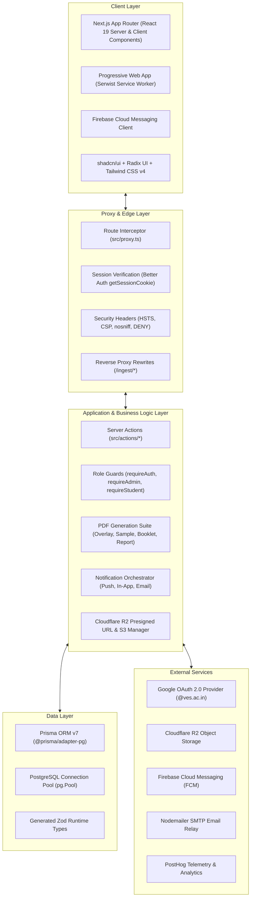
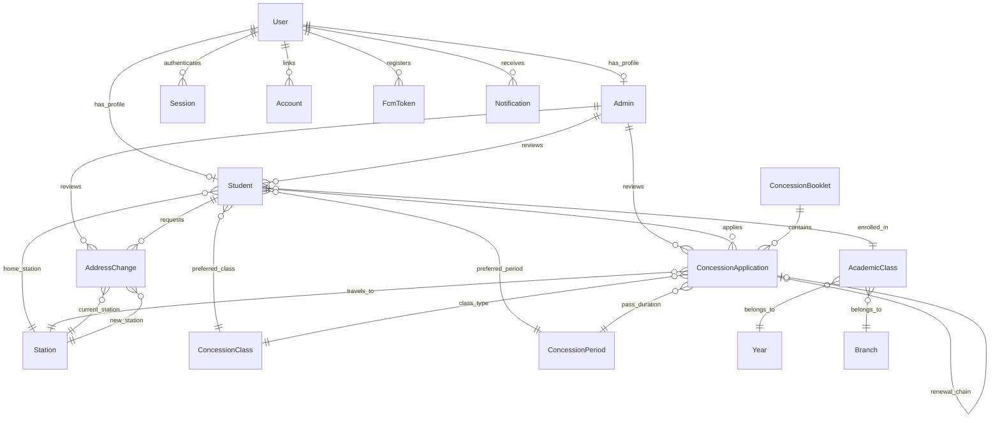
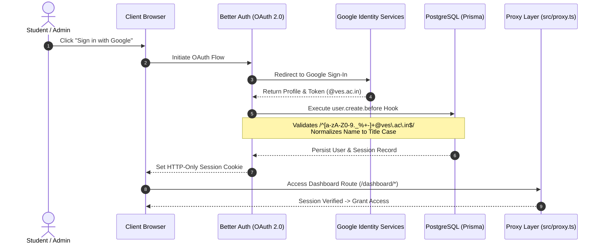
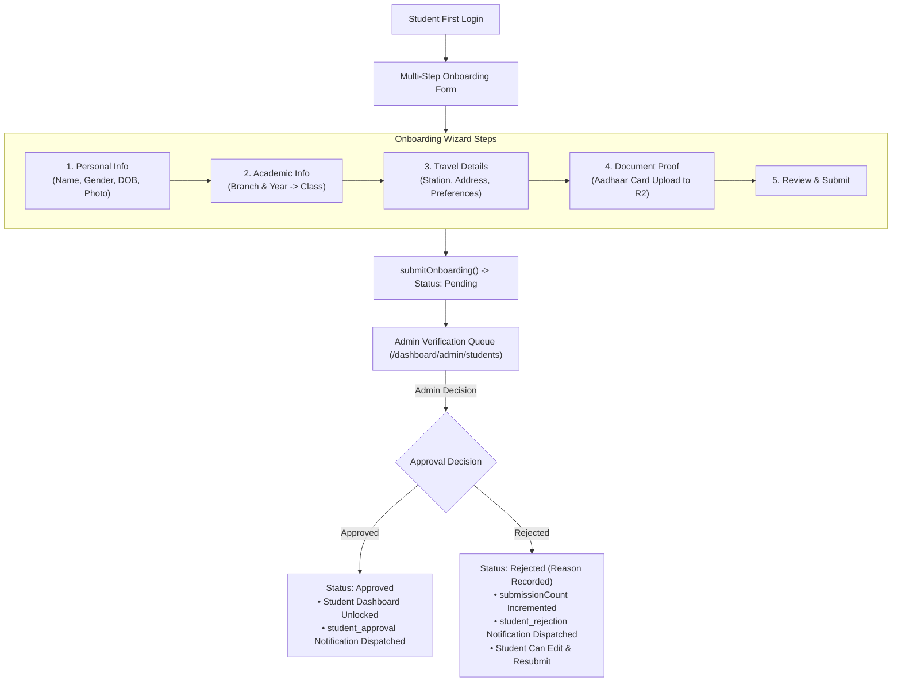
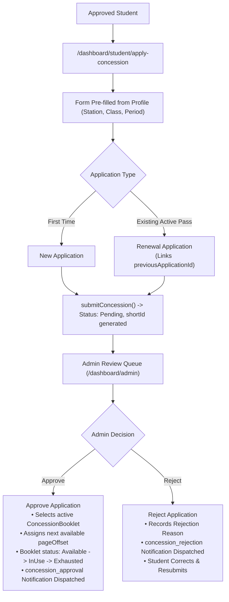
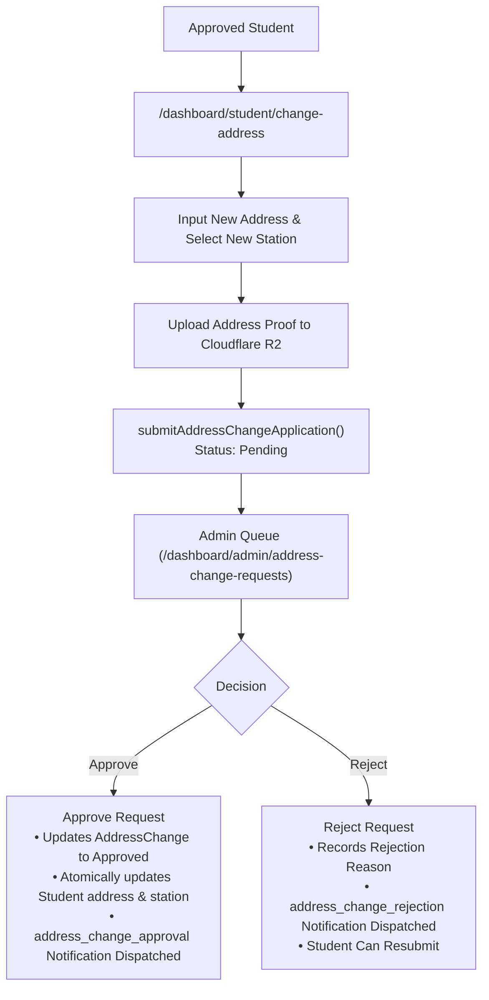
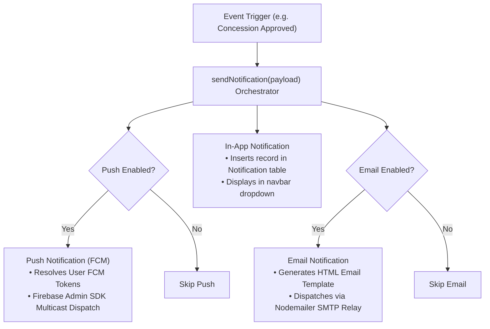

# VESITRail Architecture Documentation

## Executive Summary

VESITRail is an enterprise-grade Progressive Web Application (PWA) engineered to digitize, automate, and streamline the entire railway student concession lifecycle for **Vivekanand Education Society's Institute of Technology (VESIT)**, Mumbai. Built on Next.js 16 with TypeScript and React Server Components, the system eliminates paper-heavy manual workflows by automating student verification, concession issuance, booklet tracking, dynamic certificate print overlay, and multi-channel notifications.

### Core Mission

To provide a secure, automated, and auditable digital platform managing end-to-end railway concession operations:

- Student onboarding and demographic/academic validation
- New concession applications and renewal chains
- Physical concession booklet inventory and serial numbering
- Dynamic certificate overlay calibration and bulk PDF generation
- Student address and railway station modifications
- Multi-channel notification delivery (Push, In-App, Email)

### System Specifications & Key Metrics

| Dimension                     | Specification                                                                                           |
| :---------------------------- | :------------------------------------------------------------------------------------------------------ |
| **Framework**                 | Next.js 16 (`16.3.2`) with App Router & Server Actions                                                  |
| **UI Library & Runtime**      | React 19 (`^19.2.7`), TypeScript 6 (`6.0.3`), Node.js `24.x`, pnpm `11.21`                              |
| **Database & ORM**            | PostgreSQL with Prisma ORM (`^7.2.0`), `@prisma/adapter-pg` driver adapter & `pg` connection pooling    |
| **Type & Runtime Validation** | Zod (`^4.4.3`) with `zod-prisma-types` auto-generation                                                  |
| **Authentication**            | Better Auth (`^1.6.28`) with Google OAuth 2.0 (strictly restricted to `@ves.ac.in` domain)              |
| **Styling & UI System**       | Tailwind CSS v4, Radix UI primitives, shadcn/ui, Lucide Icons, Sonner                                   |
| **PWA & Offline**             | Serwist (`^9.5.11`) with custom Service Worker caching strategies                                       |
| **File Storage**              | Cloudflare R2 via AWS SDK S3 Client (`@aws-sdk/client-s3`, `@aws-sdk/s3-request-presigner`)             |
| **Document Generation**       | jsPDF (`^4.2.1`), jsPDF-AutoTable (`^5.0.8`), pdf-lib (`^1.17.1`)                                       |
| **Notifications**             | Firebase Cloud Messaging (Firebase Admin SDK `^14.2.0` / Client `^12.17.1`), Nodemailer SMTP, In-App DB |
| **Observability & Telemetry** | PostHog (`posthog-js`, `posthog-node`) via reverse proxy `/ingest` rewrites                             |
| **Quality & Testing**         | Playwright (`^1.62.1`) for End-to-End (E2E) testing, ESLint 9, Prettier                                 |

---

## High-Level System Architecture

VESITRail follows a modern **Layered Serverless Architecture** leveraging React Server Components (RSC), Next.js Server Actions, and database connection pooling to deliver sub-second response times with zero client-side state boilerplate.



---

## Database Architecture

### Modular Schema Organization

The database schema is organized into modular `.prisma` definition files under `prisma/models/`, compiled by Prisma with client and Zod generators:

- `prisma/schema.prisma` - Root datasource, generators, core `User`, `Session`, `Account`, `Verification`, `FcmToken`, `Notification`, and `AppConfig` models.
- `prisma/models/enums.prisma` - System-wide enum definitions (`Gender`, `FcmPlatform`, `AddressChangeStatus`, `StudentApprovalStatus`, `ConcessionBookletStatus`, `ConcessionApplicationType`, `ConcessionApplicationStatus`).
- `prisma/models/admin.prisma` - Administrative privileges and review relations.
- `prisma/models/student.prisma` - Student profile, academic structure (`Class`, `Branch`, `Year`), and `AddressChange`.
- `prisma/models/legacy-student.prisma` - Preloaded legacy student directory for station verification during migration.
- `prisma/models/concession.prisma` - `ConcessionApplication`, `ConcessionBooklet`, `Station`, `ConcessionClass`, and `ConcessionPeriod`.

### Entity-Relationship Model



### Core Domain Models

#### 1. Identity & Access Domain (`schema.prisma`)

- **`User`**: Primary identity record created on Google OAuth callback. Stores name (auto-formatted to Title Case), email, and global notification preferences (`pushNotificationsEnabled`, `emailNotificationsEnabled`).
- **`Session`**: Session token, expiration, user-agent, and IP address.
- **`Account`**: OAuth provider tokens, refresh tokens, and provider IDs.
- **`FcmToken`**: Device registration records storing FCM tokens indexed by `[userId, deviceId]` with platform indicator (`Web`, `iOS`, `Android`).
- **`Notification`**: Persistent in-app notifications containing `title`, `body`, optional action `url`, and read state (`isRead`).
- **`AppConfig`**: Dynamic system-wide key-value storage (e.g. `form_layout` JSON coordinate mapping).

#### 2. Student & Academic Domain (`prisma/models/student.prisma`, `legacy-student.prisma`)

- **`Student`**: Extends `User` with demographic data (`firstName`, `middleName`, `lastName`, `gender`, `dateOfBirth`, `address`), document attachment (`verificationDocUrl`), academic class linkage (`classId`), home railway station (`stationId`), and default concession preferences (`preferredConcessionClassId`, `preferredConcessionPeriodId`). Tracks approval status (`StudentApprovalStatus`: `Pending`, `Approved`, `Rejected`), `submissionCount`, and `rejectionReason`.
- **`Class`**: Academic cohort linking `Year` (e.g. FE, SE, TE, BE) and `Branch` (e.g. CMPN, INFT, EXTC, AIDS).
- **`LegacyStudent`**: Master preloaded table of existing student email addresses and historical railway stations used to enforce station continuity when legacy students transition to the digital platform.

#### 3. Concession & Booklet Domain (`prisma/models/concession.prisma`)

- **`ConcessionApplication`**: Central application record.
  - Identification: UUID `id` + auto-incrementing integer `shortId` for human-friendly reference.
  - Types: `New` or `Renewal`.
  - Statuses: `Pending`, `Approved`, `Issued`, `Rejected` (`ConcessionApplicationStatus`).
  - Booklet Linkage: References `concessionBookletId` and 0-indexed `pageOffset` within the booklet. Enforces uniqueness on `@@unique([concessionBookletId, pageOffset])`.
  - Renewal Auditing: Self-referencing 1:1 relation (`previousApplicationId` -> `renewalApplication`) forming an immutable history chain.
  - Resubmission Support: `submissionCount` and `rejectionReason`.
- **`ConcessionBooklet`**: Physical railway concession voucher book representation.
  - Capacity: `totalPages` (default 50 entries).
  - Serial Range: `serialStartNumber` (e.g. `A0807550`) and calculated `serialEndNumber` (`A0807599`).
  - Print Calibration: `anchorX` and `anchorY` floating-point coordinates for printer hardware offset calibration.
  - Status: `ConcessionBookletStatus` (`Available`, `InUse`, `Exhausted`).
- **`AddressChange`**: Student request to alter residential address and home railway station.
  - Stores current vs new address/station snapshots.
  - Verification document URL for proof of address.
  - Workflow status (`Pending`, `Approved`, `Rejected`) with admin review audit fields.

---

## Authentication & Authorization Architecture

### Authentication Pipeline



### Route Protection & Next.js Proxy Layer

Route security is enforced via `src/proxy.ts` matching all non-static paths:

- **Public Routes**: `/`, `/auth-error`, `/privacy-policy`, `/terms-of-service`, `/api/*`, static assets.
- **Protected Routes**: `/dashboard/*`, `/onboarding/*`. Unauthenticated requests lacking a valid session cookie are immediately redirected to `/`.

### Server Action Authorization Guards (`src/lib/auth-guard.ts`)

Every Server Action enforces granular server-side role verification:

```typescript
// 1. Base Authentication Check
export const requireAuth = async (): Promise<Result<AuthSession, AuthError>>;

// 2. Administrator Access Check (Verifies user.admin and admin.isActive)
export const requireAdmin = async (): Promise<Result<AdminSession, AuthError>>;

// 3. Student Access Check (Verifies student profile exists and status === "Approved")
export const requireStudent = async (): Promise<Result<StudentSession, AuthError>>;
```

---

## Core Feature Workflows

### 1. Student Onboarding & Verification



### 2. Concession Application & Renewal Lifecycle



### 3. Address & Home Station Change Workflow



---

## Document Generation & PDF Engine

VESITRail contains a comprehensive document rendering subsystem built on `jspdf`, `jspdf-autotable`, and `pdf-lib`:

| Module                        | File                                         | Target & Orientation                  | Description                                                                                                                                                                  |
| :---------------------------- | :------------------------------------------- | :------------------------------------ | :--------------------------------------------------------------------------------------------------------------------------------------------------------------------------- |
| **Certificate Print Overlay** | `src/actions/generate-overlay-pdf.ts`        | Custom Slip (Landscape, 90° rotation) | Ingests approved application metadata, applies `AppConfig.form_layout` and booklet `(anchorX, anchorY)` coordinates, and prints directly onto government certificate leaves. |
| **Calibration Test Overlay**  | `src/actions/generate-sample-overlay-pdf.ts` | Custom Slip (Landscape)               | Generates an interactive test sheet with alignment markers for administrators to calibrate printer hardware.                                                                 |
| **Master Booklet Register**   | `src/actions/generate-booklet-pdf.ts`        | Legal (Landscape)                     | Compiles all 50 entries into an official tabular register with serial numbers, dates, student data, cancelled markers, and IST timestamps.                                   |
| **Admin Analytics Report**    | `src/actions/analytics.ts`                   | A4 (Portrait)                         | Summarizes administrator review throughput with KPI summary cards and detailed contribution breakdowns across timeframes (`1m`, `3m`, `6m`, `1y`, `all`).                    |

### Dynamic Form Layout & Coordinate Calibration

To accommodate variation across physical railway certificate batches and printer hardware:

1. **Configurable Grid Layout**: Stored in `AppConfig` under `form_layout` key, mapping field keys (e.g. `student_name_left`, `from_station_left`, `class_right`, `age_years`, `date_of_issue`) to relative `{ x, y }` points.
2. **Booklet Anchor Offsets**: Each physical booklet defines base offsets `anchorX` and `anchorY`.
3. **Effective Coordinate Formula**:
   $$\text{Coord}_{\text{effective}} = (\text{anchorX} + \text{field.x},\; \text{anchorY} + \text{field.y})$$
4. **Calibration UI**: Admin interface at `/dashboard/admin/form-layout` allows real-time interactive tuning with instant sample PDF preview.

---

## Multi-Channel Notification Subsystem

VESITRail dispatches synchronized notifications across three distinct channels based on granular user preferences:



### Notification Scenarios

| Scenario ID                | Category         | Type        | Channels            | Description / Trigger                                      |
| :------------------------- | :--------------- | :---------- | :------------------ | :--------------------------------------------------------- |
| `student_approval`         | `student`        | `approval`  | Push, Email, In-App | Student account verified and approved by administrator     |
| `student_rejection`        | `student`        | `rejection` | Push, Email, In-App | Student registration rejected; requests document update    |
| `concession_approval`      | `concession`     | `approval`  | Push, Email, In-App | Concession pass issued; directs student to Admin Office    |
| `concession_rejection`     | `concession`     | `rejection` | Push, Email, In-App | Application details incorrect; directs student to resubmit |
| `address_change_approval`  | `address_change` | `approval`  | Push, Email, In-App | Address and station modification approved                  |
| `address_change_rejection` | `address_change` | `rejection` | Push, Email, In-App | Address modification rejected; requests valid proof        |

---

## Progressive Web App & Offline Architecture

Powered by **Serwist** (`@serwist/next`, `@serwist/sw`) in `src/sw.ts`, the PWA architecture guarantees fast load times, offline resilience, and push integration.

### Caching Strategy Matrix

```typescript
// Serwist Service Worker Strategy Configuration (src/sw.ts)
1. Precache Manifest: Core static shell, icons, manifest, and offline assets
2. CacheFirst:
   - Google Web Fonts (fonts.googleapis.com, fonts.gstatic.com)
   - Static images & Next.js optimized assets
   - Stylesheets and JavaScript script chunks
3. NetworkFirst:
   - HTML documents and app route navigations
4. NetworkOnly:
   - Next.js Server Actions & POST/PUT API mutations
   - Better Auth authentication routes (/api/auth/*)
   - Cloudflare R2 presigned upload/download endpoints
```

### PWA Lifecycle & Push Capabilities

- **Installability**: Standalone web app manifest (`src/app/manifest.ts`) with custom icons and navigation shortcuts.
- **Push Event Handling**: Service worker listens for background `push` events, displaying system notifications with custom action buttons and icon assets.
- **Notification Click Routing**: Handles `notificationclick` events, focusing existing windows or navigating directly to relevant dashboards.
- **Dynamic Version Invalidation**: Checks `/api/github` for newly published releases and alerts users with interactive reload toasts.

---

## Observability, Analytics & Telemetry

### Client & Server PostHog Integration

- **Client Tracking**: `posthog-js` initialized with user identification, recording funnel transitions and application interactions.
- **Server Tracking**: `posthog-node` capturing mission-critical server-side events (approval throughput, booklet completion).
- **Reverse Proxy Privacy**: Configured via Next.js rewrites in `next.config.ts` mapping `/ingest/*` directly to PostHog ingest endpoints, bypassing ad-blockers and preserving analytics fidelity.

### Administrative Throughput Analytics

- Real-time aggregation of admin activity (`studentsReviewed`, `applicationsReviewed`, `addressChangesReviewed`).
- Flexible timeframe filtering (`1m`, `3m`, `6m`, `1y`, `all`).
- Direct export to branded executive PDF reports via `generateAdminAnalyticsPDF()`.

---

## Security Architecture

### 1. Identity & Domain Restriction

- **Google OAuth 2.0**: Integrated via Better Auth.
- **Domain Whitelist**: Institutional `@ves.ac.in` domain enforced via regex at the database hook level (`user.create.before`), preventing unauthorized accounts from being provisioned.

### 2. Defense-in-Depth Authorization

- **Proxy Layer Isolation**: `src/proxy.ts` validates session cookies before routing to protected dashboard paths.
- **Server Action Guards**: Every mutation and data fetch verifies caller credentials (`requireAdmin`, `requireStudent`).
- **Row-Level Protection**: Queries enforce student ownership checks to prevent unauthorized cross-student record access.

### 3. Storage & Transport Security

- **Cloudflare R2**: Secure direct uploads using short-lived presigned URLs.
- **Strict HTTPS & Security Headers**: HSTS (`max-age=31536000; includeSubDomains`), `X-Frame-Options: DENY`, `X-Content-Type-Options: nosniff`, and restricted `Permissions-Policy`.

### 4. Data Validation & Injection Prevention

- **Prisma Parameterization**: All SQL queries executed through parameterized queries via Prisma and the PostgreSQL adapter.
- **Zod Runtime Validation**: Schemas validate all input payloads before business logic execution.

---

## Development, Testing & Deployment

### Development Workflow

```bash
# 1. Install dependencies
pnpm install --frozen-lockfile

# 2. Synchronize database schema and generate Prisma/Zod artifacts
pnpm exec prisma generate
pnpm exec prisma db push

# 3. Start local development server
pnpm dev

# 4. Execute End-to-End test suite
pnpm run test:e2e
```

---

**Document Version**: 2.0  
**Maintained By**: VESITRail Core Architecture Team
